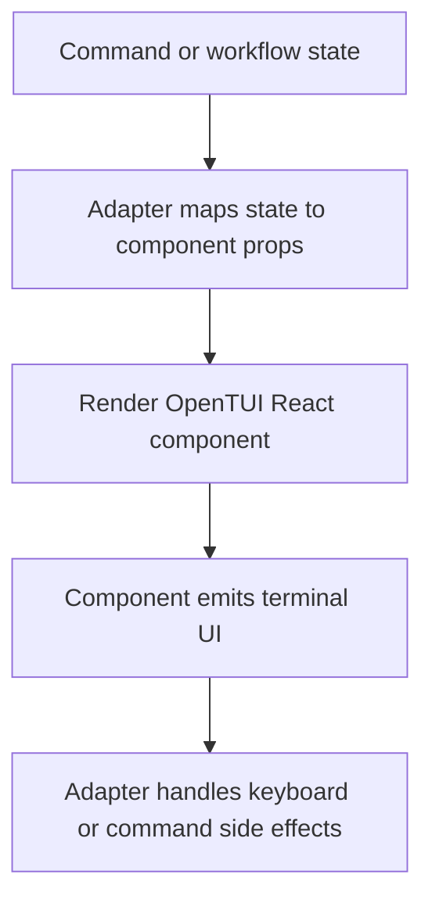

# @gg-utils/opentui-ui-kit

Reusable React/OpenTUI terminal UI components for command surfaces.

This package provides focused primitives for spinners, progress displays, confirmation prompts,
multi-select controls, status indicators, badges, and dividers. It is a component library, not a
command framework.

## Install

```bash
npm install @gg-utils/opentui-ui-kit@git+https://github.com/gg-utils/opentui-ui-kit.git#main
```

Peer/runtime dependencies are declared in the package manifest:

```bash
npm install @opentui/core @opentui/react react
```

Pinned dependency example:

```json
{
  "dependencies": {
    "@gg-utils/opentui-ui-kit": "git+https://github.com/gg-utils/opentui-ui-kit.git#5e47266"
  }
}
```

## When To Use

- You are building a React/OpenTUI terminal interface.
- You need reusable command-progress, status, selection, or confirmation widgets.
- You want consistent terminal UI primitives across several packages or CLIs.

Skip this package when you need command planning, subprocess lifecycle management, or repo-specific
workflow state.

## Public Surfaces

| Import | Purpose |
|---|---|
| `@gg-utils/opentui-ui-kit` | Root component barrel. |
| `@gg-utils/opentui-ui-kit/spinner` | Spinner components and presets. |
| `@gg-utils/opentui-ui-kit/progress` | Progress bars and multi-step progress. |
| `@gg-utils/opentui-ui-kit/input` | Confirmation input components. |
| `@gg-utils/opentui-ui-kit/select` | Multi-select and tag-select components. |
| `@gg-utils/opentui-ui-kit/status` | Status indicators, badges, colors, and symbols. |
| `@gg-utils/opentui-ui-kit/layout` | Layout dividers. |

## Quick Start

```tsx
import React from "react";
import {
  Divider,
  ProgressBar,
  StatusIndicator,
} from "@gg-utils/opentui-ui-kit";

export function InstallPanel(): React.ReactNode {
  return (
    <>
      <StatusIndicator label="Install" status="pending" />
      <ProgressBar value={3} max={5} />
      <Divider label="details" />
    </>
  );
}
```

## Operational Flow



## Development

```bash
git clone https://github.com/gg-utils/opentui-ui-kit.git
cd opentui-ui-kit
npm install
npm run type-check
npm run build
```

## Layout

```text
.
|-- src/spinner/
|-- src/progress/
|-- src/input/
|-- src/select/
|-- src/status/
|-- src/layout/
|-- examples/
|-- dist/
`-- package.json
```

## Caveats

- Components expect an OpenTUI React runtime.
- This package does not own workflows, subprocesses, or application state machines.
- Keep command labels and domain copy in consuming apps where possible.
